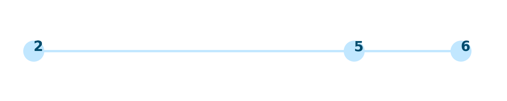

# Visualiser

This visualiser works by showing the nodes being communicated with during an operation. It shows the nodes involved in the lookup relative to the hash space.



## Dependencies
The code uses the following Python libraries which can be installed using `pip install <library_name>`:

- `matplotlib`
- `pandas`


Make sure that the directory follows this structure:
```
- 📂 log_folder
    - 📃 msg.csv
    - 📃 operations.csv
- 📃 index.py
```

## Usage

To run it just run:
```
python index.py
```